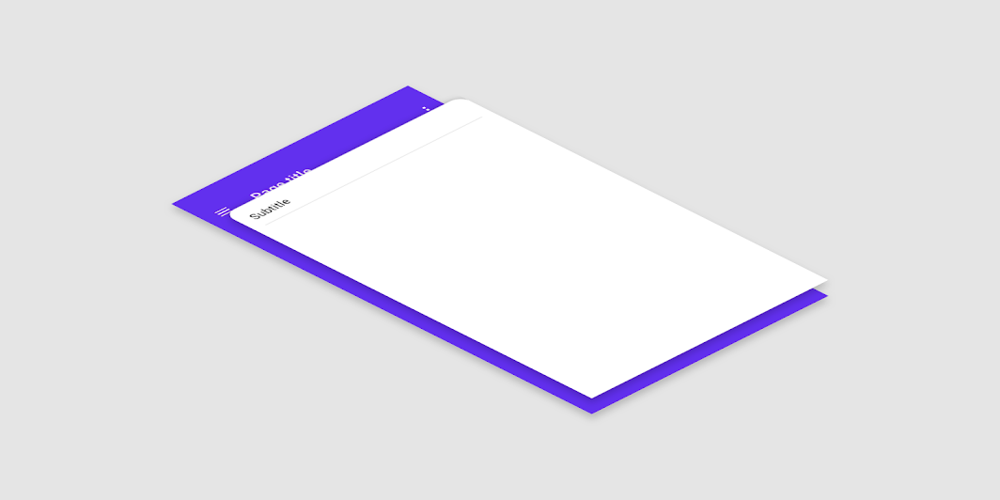
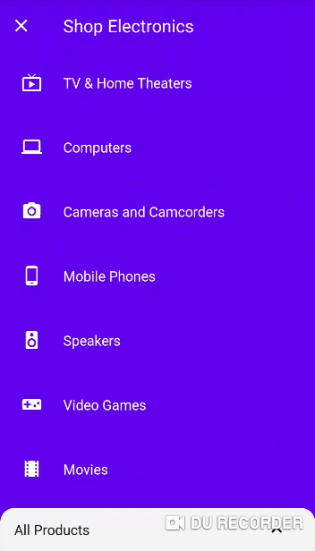

# react-native-material-backdrop-modal
Material Design "Backdrop" component for Android and iOS.

- [Setup](#setup)
- [Usage](#usage)
- [Props](#props)

## Setup
1. Install:
    - Using [npm](https://www.npmjs.com/#getting-started): `npm install react-native-material-backdrop-modal --save`
    - Using [Yarn](https://yarnpkg.com/): `yarn add react-native-material-backdrop-modal`

2. Import it in your JS:
    ```js
    import Backdrop from 'react-native-material-backdrop-modal';
    ```

## Usage
A backdrop appears behind all other surfaces in an app, displaying contextual and actionable content.



See Google's [Material Design guidelines](http://material.io/components/backdrop/) for more info about Backdrops and when to use them.

Check out the example app:

```bash
git clone https://github.com/brunohkbx/react-native-material-backdrop-modal
cd react-native-material-backdrop-modal/example
yarn
yarn start
```



## Props
| prop                      | default                  | type          | description                                                                                                                                                     |
| ------------------------- | ------------------------ | ------------- | --------------------------------------------------------------------------------------------------------------------------------------------------------------- |
| children                  |                  | node        | Content of `Backdrop     `                                                                                                                                       |
| focused            | true                     | boolean        | Specifies whether `Backdrop` should be focused                                                                                                                                        |
| onFocus           |                      | Function        | The Handler that's emitted every time the user conceals the back layer.                                                                                                                          |
| title         |  | string        | The Subheader title                                                                                                                             |
| icon | | element | Icon to be used on the Subheader
| preset | easeInEaseOut | object | Animation [presets](https://reactnative.dev/docs/layoutanimation#presets) to pass into configureNext
| titleStyle | {} | object | Style for the subheader title
| backdropStyle |{} | object | Style for the backdrop
